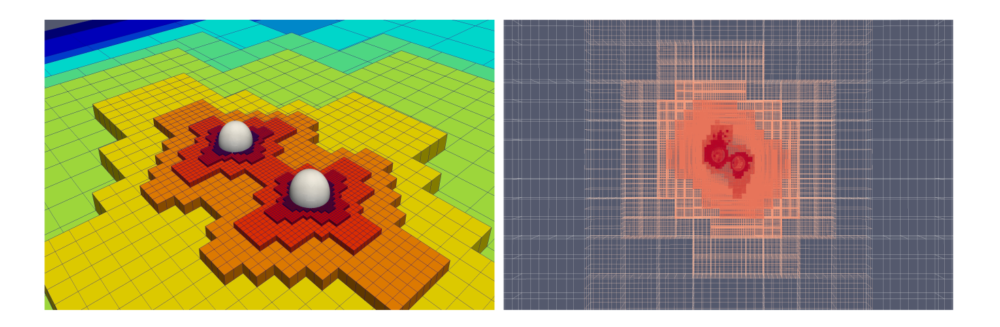
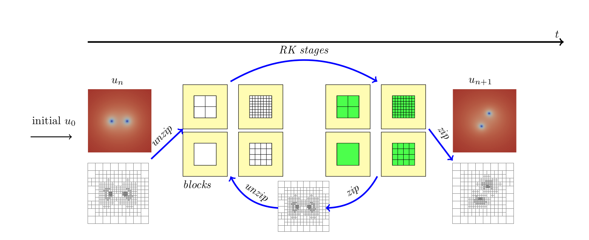
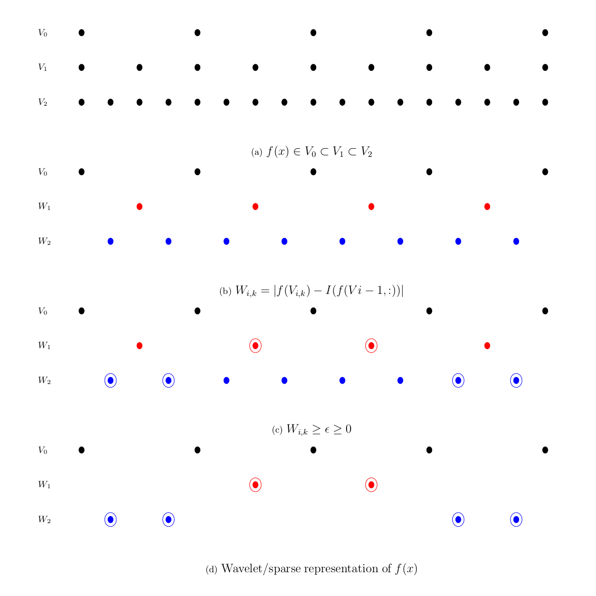
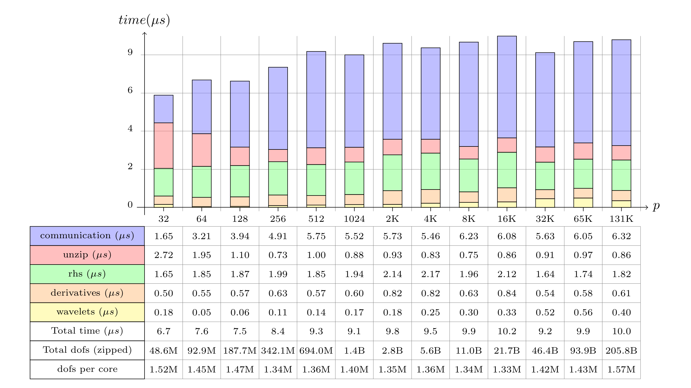
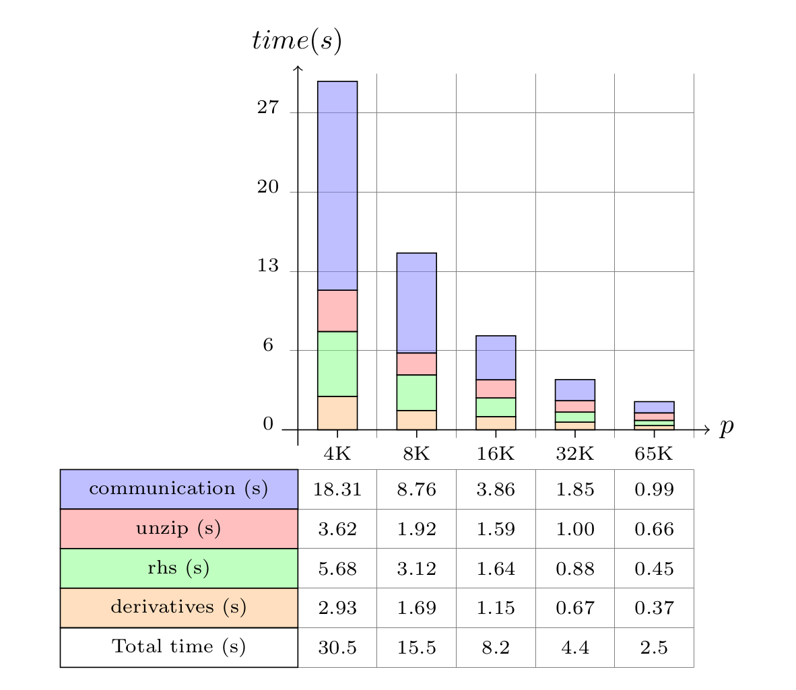

# Dendro-GR

## Binary compact mergers

<video width="320" height="240" controls>
<source src="doc/vids/bssn_r1_chi.mp4" type="video/mp4">
Your browser does not support the video tag.
</video> 

BSSN variable chi

<video width="320" height="240" controls>
<source src="doc/vids/bssn_r1_chi_wf.mp4" type="video/mp4">
Your browser does not support the video tag.
</video> 

BSSN variable chi with refinement

<video width="320" height="240" controls>
<source src="doc/vids/bssn_r1_Re_psi4.mp4" type="video/mp4">
Your browser does not support the video tag.
</video> 

Real part of psi4 scalar

<video width="320" height="240" controls>
<source src="doc/vids/bssn_r1_Img_psi4.mp4" type="video/mp4">
Your browser does not support the video tag.
</video> 

Imaginary part of psi4 scalar

(left) A example of the adaptive mesh created by Dendro for the binary black-hole system. (right) the hierarchical wavelet grids generated for the binary black hole system. 

## Overiew of Dendro-GR

This figure illustrates the calculation of a single Runge-Kutta (RK) time step, computing the solution at the advanced time, u n+1 , from data at the previous time step, $u_n$. For computational efficiency, spatial and time derivatives are evaluated on equispaced blocks (unzipped); a sparse grid constructed from wavelet coefficients is used for communication and to store the final solution (zipped). For each RK stage s we perform the unzip operation which results in a sequence of blocks which are used to compute the solution on the internal block (green), using the padding values at the block boundary (yellow) followed by a zip operation in between RK stages while the final update (i.e. next time step) performed using the zip version of the variables. Note that the re-meshing is performed as needed based on the wavelet expansion of the current solution

## How Wavelet Adaptive Mesh Refinement (WAMR) works ?

For a given function $f:V \rightarrow R$ let $V_i \in V$ be the finite dimensional approximation of $f$ (see Figure 3a). As number of nodes increases (i.e. going from $V_i$ to $V_{i+1}$ ) for each additional node introduced, we compute wavelet coefficients based on the absolute difference between $f(V_{i,k})$ and interpolated value from previous level $f($V_{i−1},:)$ (see Figure 3b). In Figure 3c shows the chosen nodes that violate specified wavelet tolerance epsilon and these nodal wavelets are stored as the sparse/wavelet representation of function f (see Figure 3d).

## Contributions

* Dendro-GR portable and highly-scalable algorithm and framework that targets problems in the astrophysics and numerical relativity
communities. This framework combines Dendro octree with Wavelet Adaptive  Multiresolution (WAMR) and a physics module to solve the Einstein equations of general relativity in BSSN formulation.

* Wavelet adaptive multiresolution is used to provide local, fine-grain adaptivity, based on the fast wavelet transform of interpolating wavelets.

* The goal of this work is to perform advanced, massively parallel numerical simulations of Intermediate Mass Ratio Inspirals (IMRIs)  of binary black holes with mass ratios on the order of 100:1. These studies will be used to generate waveforms for use in LIGO data analysis and to calibrate semi-analytical approximate methods. 

* This advanced framework is designed to easily accommodate many existing algorithms in astrophysics
for %compressible plasma dynamics and radiation hydrodynamics.

* We have designed novel algorithms to enable efficient simulations for such  experiments and demonstrate excellent weak scalability up to 131K cores on ORNL's Titan.

## Results

# Weak Scalability in Titan (upto $131,000$ cores )

Weak scaling results in ORNL's Titan for  $RK/(dof/p)$ (averaged over 10 steps) where $RK,dof,p$ denotes the time for single $RK$ step, degrees of freedom, and number of cores respectively,  with derivative computation (\texttt{deriv}), right hand side( {\texttt rhs}) computation, \texttt{unzip} cost, wavelet computation(\texttt{wavelets}) and communication cost (\texttt{comm}) with the average of 1.41M unknowns per core where the number of cores ranging from $32$ to $131,072$ cores on $8,192$ nodes where the largest problem having $206$ Billion unknowns. Above results are generated with mass ratio $\mu=10$ with \maxDepth~ 18 and wavelet tolerance of $10^{-6}$. Note that the unknowns per core have a slight variation since with WAMR we do not have explicit control over the grid size and WAMR decides the refinement region on the mesh based on the how wavelets behave during the time evolution. This is why we have reported normalized $RK$ with $dof/p$ metrics to report accurate weak scaling results.

# Strong scalability (upto $64,000$ cores)

Strong scaling results in ORNL's Titan for a single RK step (averaged over 10 steps) with derivative computation (\texttt{deriv}), right hand side( {\texttt rhs}) computation, \texttt{unzip} cost and communication cost (\texttt{comm}) for a fixed problem size of $10.5B$ unknowns where the number of cores ranging from $4,096$ to $65,536$ cores on $4096$ nodes. Note that for strong scaling results re-meshing is disabled in order to keep the problem size fixed.

Dendro-GR Team

 * Milinda Fernando (School of Computing, University of Utah)
 * Hari Sundar (School of Computing, University of Utah)
 * David Neilsen (Department of Physics and Astronomy, Brigham Young University)
 * Hyun Lim (Department of Physics and Astronomy, Brigham Young University)
 * Eric Hirschmann (Department of Physics and Astronomy, Brigham Young University)

